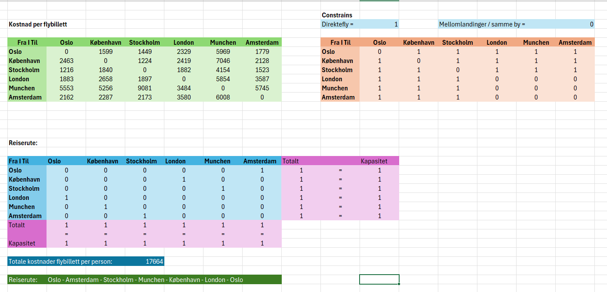

# Route & Pricing Optimization

**Business Analytics project | OsloMet | Grade: A**

A quantitative analysis project examining how optimization models can support
route planning and ticket pricing decisions.

## Project Overview

The project addressed two connected business problems:

1. How to identify a cost-efficient travel route between European destinations.
2. How ticket prices could be determined under constraints related to demand,
   capacity, costs and a defined revenue target.

The analysis was conducted using linear programming, Microsoft Excel Solver
and sensitivity analysis.

## Methods

- Linear Programming
- Excel Solver
- Sensitivity Analysis
- Quantitative Analysis
- Optimization
- Descriptive Statistics

## Tools

- Microsoft Excel
- Excel Solver

## 1. Route Optimization

The first model aimed to identify the lowest-cost travel route between six
European destinations.

The model considered:

- Flight ticket costs
- Availability of direct flights
- Required destinations
- Route constraints
- Oslo as both starting and ending point

Excel Solver was used to identify the optimal combination of routes subject
to these constraints.

### Optimization Model

### Result

The optimized route was:

**Oslo → Amsterdam → Stockholm → Munich → Copenhagen → London → Oslo**

Estimated flight cost:

**NOK 17,664 per person**

## 2. Ticket Pricing Optimization

The second model examined ticket pricing under commercial constraints.

The model incorporated:

- Estimated ticket demand
- Venue capacity
- Minimum ticket prices
- Maximum ticket prices
- Venue costs
- Revenue target

Excel Solver was used to determine ticket prices satisfying the defined
constraints.

## 3. Sensitivity Analysis

Sensitivity analysis was used to examine how changes in important assumptions
could affect the optimal solution.

The analysis included changes in:

- Flight costs
- Demand
- Route constraints
- Model parameters

This provided insight into how robust the optimal solution was when underlying
conditions changed.

## Business Interpretation

The project demonstrates how quantitative optimization can support commercial
decision-making when several factors must be considered simultaneously.

Route and pricing decisions involve trade-offs between cost, capacity, demand
and revenue. Optimization models provide a structured way to evaluate these
trade-offs, while sensitivity analysis helps identify which assumptions have
the greatest impact on the recommended solution.

## Academic Context

This project was completed as part of the Business Analytics course in the
Bachelor of Business Administration programme at OsloMet.

**Grade: A**

## Further Development

The original analysis was developed in Microsoft Excel using Solver.

Future extensions of the project may include:

- Reproducing the optimization model in Python
- Demand forecasting
- Scenario analysis
- Revenue optimization
- Data visualization# route-pricing-optimization
- Route and ticket pricing optimization using linear programming, Excel Solver and sensitivity analysis.
